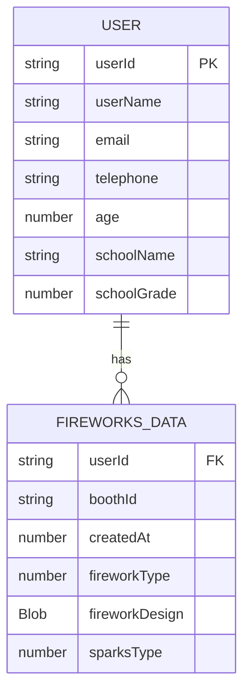

# HANABINOVATION データ設計書
データの保存にはユーザーのlocal.storageとAWS DynamoDBを用いる。

## local.storage
```ts
    {
        userId: string; // ユーザーID
    }
```

## DynamoDB
```ts
    {
        [userId: string]: { // ユーザーID
            userName: string | null; // ユーザー名
            email: string | null; // メールアドレス
            telephone: string; // 電話番号
            age: number; // 年齢
            schoolName: string; // 学校名
            schoolGrade: number; // 学年
            fireworksData: {
                [boothId: string]: { // 各ブースのID
                    createdAt: number | null; // データが登録された日時
                    fireworkType: number; // 花火のセットアップの種類(0の場合はオリジナルデザインを使用)
                    fireworkDesign: Blob; // ユーザーが作成した花火のオリジナルデザイン
                    sparksType: number; // 火花のセットアップの種類
                };
            };
        };
    }
```


