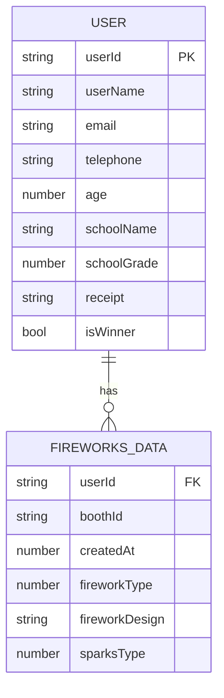

# HANABINOVATION データ設計書
データの保存にはユーザーのlocal.storageとAWS DynamoDBを用いる。

## local.storage
```ts
    {
        userId: string; // ユーザーID
    };
```

## DynamoDB
```ts
    {
        [id: string]: { // ユーザーID
            profile: {
                userName: string; // ユーザー名
                email: string; // メールアドレス
                telephone: string; // 電話番号
                age: number; // 年齢
                schoolName: string; // 学校名
                schoolGrade: number; // 学年
                receipt: string; // 抽選受付番号
                isWinner: boolean; // 当選済みかどうか
            };
            fireworksData: {
                [boothId: string]: { // 各ブースのID
                    createdAt: number; // データが登録された日時
                    fireworkType: number; // 花火のセットアップの種類(0の場合はオリジナルデザインを使用)
                    fireworkDesign: string; // ユーザーが作成した花火のオリジナルデザイン
                    sparksType: number; // 火花のセットアップの種類
                };
            };
        };
    };
```


